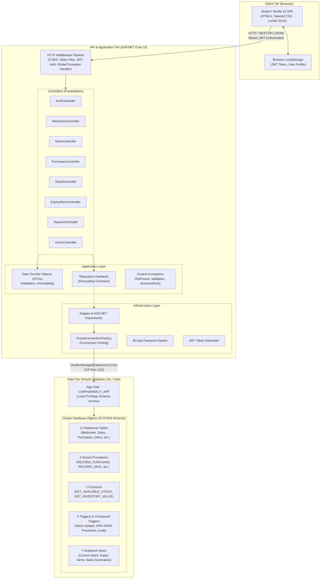
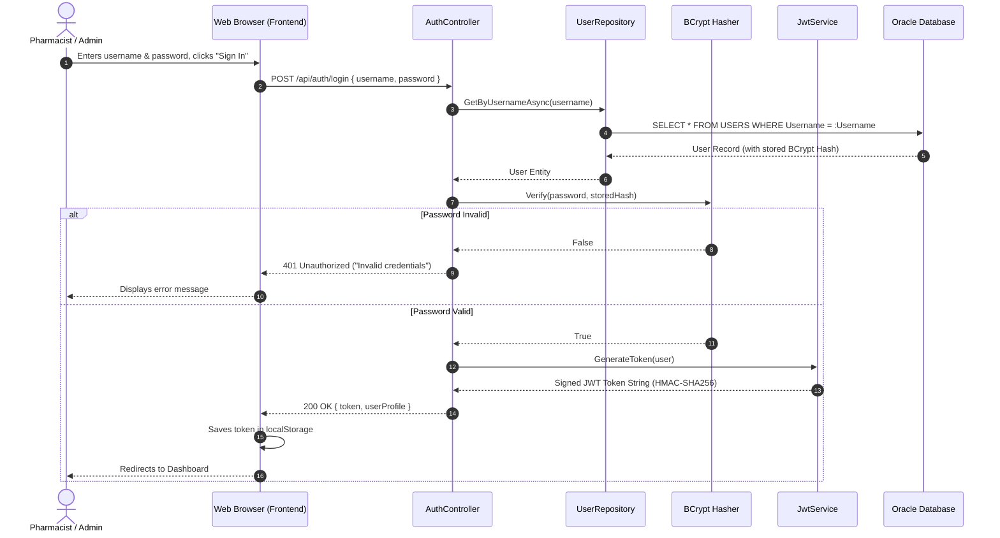
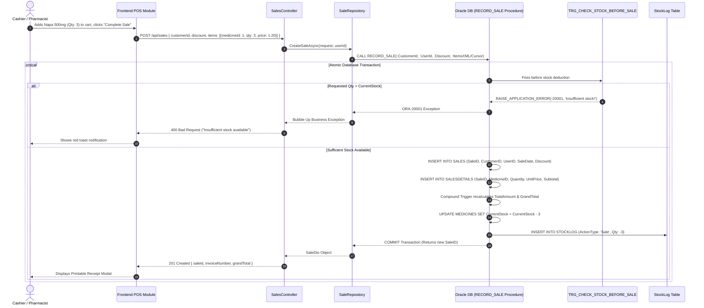

# Chapter 2: System Architecture & High-Level Design

In this chapter, we explore the structural blueprint, design patterns, and end-to-end data flows of the **Al-Dawah Pharmacy Inventory & Sales Management System**.

Whether you are evaluating the system for production deployment, learning enterprise application architecture, or preparing to extend its capabilities, this document details how each layer is engineered.

---

## 1. System Vision & Business Domain

A retail or hospital pharmacy is not an ordinary store. In pharmacy operations, errors can directly affect patient health, and inventory mishandling results in financial loss or regulatory non-compliance:
1. **Critical Inventory Tracking**: A pharmacy must know its exact physical medicine count at every second. Selling medicines that are out of stock can lead to delayed patient care.
2. **Expiry Date & Batch Control**: Medicines expire. Selling expired medication is illegal and life-threatening. The system must automatically flag batches that are expired or approaching expiry (within 30, 60, or 90 days).
3. **Auditing & Traceability**: Every single stock movement (receiving goods from suppliers, selling to patients, removing damaged stock, or manual audit corrections) must be immutably recorded in a ledger with the user's ID, timestamp, and explanation.
4. **Security & Role-Based Access Control (RBAC)**: Cashiers (Pharmacists/Staff) should process sales and record purchases, but only Pharmacy Administrators may create user accounts, modify system settings, or perform privileged stock corrections.

---

## 2. High-Level Architectural Diagram

The system employs a **Decoupled Multi-Tier Clean Architecture**:



---

## 3. The 4 Clean Layers in the C# Backend

The backend follows the principles of Clean Architecture and Onion Architecture, organized into four projects under `src/Backend/`:

```
src/Backend/
├── Domain/              # Enterprise Business Entities (No external dependencies)
├── Application/         # DTOs, Repository Interfaces, Exceptions
├── Infrastructure/      # Oracle DB Access, Dapper, BCrypt, JWT Generation
└── Api/                 # Controllers, Middleware, Configuration, Program.cs
```

### Why Decouple Into Layers?
- **Domain Independence**: The `Domain` project has **zero** dependencies on databases, web frameworks, or third-party packages. It represents the pure business concept of a pharmacy.
- **Contract-First Design**: The `Application` layer defines `IMedicineRepository` and `ISaleRepository`. The web controllers only talk to these interfaces, meaning database implementations can be tested, refactored, or replaced without breaking the controllers.
- **Encapsulated Infrastructure**: All raw SQL, Oracle parameters, connection strings, and cryptographic libraries reside strictly inside `Infrastructure`.

---

## 4. End-to-End Data Flow Scenarios

Let us examine the exact sequence of events for the three most critical operations in the system.

### Scenario A: User Login & JWT Authentication



---

### Scenario B: Point of Sale (POS) & Real-Time Sale Processing

This is the most critical transaction in the pharmacy. It demonstrates how database triggers and stored procedures enforce business integrity:



---

### Scenario C: Stock Receiving (Purchase from Supplier)

```mermaid
sequenceDiagram
    autonumber
    actor Staff as Store In-Charge
    participant UI as Purchase Entry Screen
    participant PurCtrl as PurchasesController
    participant PurRepo as PurchaseRepository
    participant Oracle as Oracle DB (RECORD_PURCHASE Procedure)
    participant TrgStock as TRG_UPDATE_STOCK_PURCHASE

    Staff->>UI: Selects Supplier, enters Invoice #, adds medicines with batch & expiry
    UI->>PurCtrl: POST /api/purchases { supplierId, invoiceNo, items: [...] }
    PurCtrl->>PurRepo: CreatePurchaseAsync(request)
    PurRepo->>Oracle: CALL RECORD_PURCHASE(...)
    
    critical Atomic Stock Increment
        Oracle->>Oracle: INSERT INTO PURCHASES (Master record)
        Oracle->>Oracle: INSERT INTO PURCHASEDETAILS (Child line items)
        Oracle->>TrgStock: Compound Trigger triggers after insert
        TrgStock->>Oracle: UPDATE MEDICINES SET CurrentStock = CurrentStock + Qty
        TrgStock->>Oracle: INSERT INTO STOCKLOG (ActionType: 'Purchase', Qty: +Qty)
        Oracle-->>PurRepo: COMMIT & Return PurchaseID
    end
    
    PurRepo-->>PurCtrl: PurchaseDto
    PurCtrl-->>UI: 201 Created
    UI-->>Staff: Success notification; Stock refreshed across all terminals
```

---

## 5. Architectural Principles and Design Decisions

### 1. The Database Is the Single Source of Truth
Many software systems perform calculations (such as calculating order totals or updating inventory numbers) exclusively in application memory (C# or JavaScript).
**Why Al-Dawah Pharma enforces this in Oracle Database**:
- If two different cashiers at two different registers sell the last box of medicine at the exact same millisecond, in-memory checks in C# can suffer from **race conditions**.
- By placing constraints and compound triggers inside Oracle Database, the database engine uses atomic row-level locks. It is mathematically impossible to oversell stock or corrupt ledger totals, regardless of how many servers or web applications are connected.

### 2. Stateless REST API Architecture
The ASP.NET Core backend is completely **stateless**:
- The server does not store user sessions in memory.
- Every incoming HTTP request must provide an `Authorization: Bearer <JWT>` header containing cryptographically signed claims.
- **Benefit**: The backend can scale horizontally. If traffic grows, you can run 5 identical API instances behind a load balancer without needing to synchronize server sessions.

### 3. Separation of Privileges (C##PHARMACY_APP vs SYSTEM)
- The schema objects (tables, procedures, views) are owned by the schema owner.
- The web application connects using a dedicated least-privilege service account: `C##PHARMACY_APP`.
- `C##PHARMACY_APP` has only `SELECT`, `INSERT`, `UPDATE`, `DELETE`, and `EXECUTE` privileges on approved objects via public synonyms. It cannot drop tables, alter schema, or access administrative dictionaries.

---

In the next chapter, **[03: Database Deep Dive & PL/SQL Reference](file:///home/noir/Work/AL-Dawah_Pharma/documentation/03_database_deep_dive_and_sql_reference.md)**, we will examine every table, trigger, stored procedure, and SQL view in microscopic detail.
