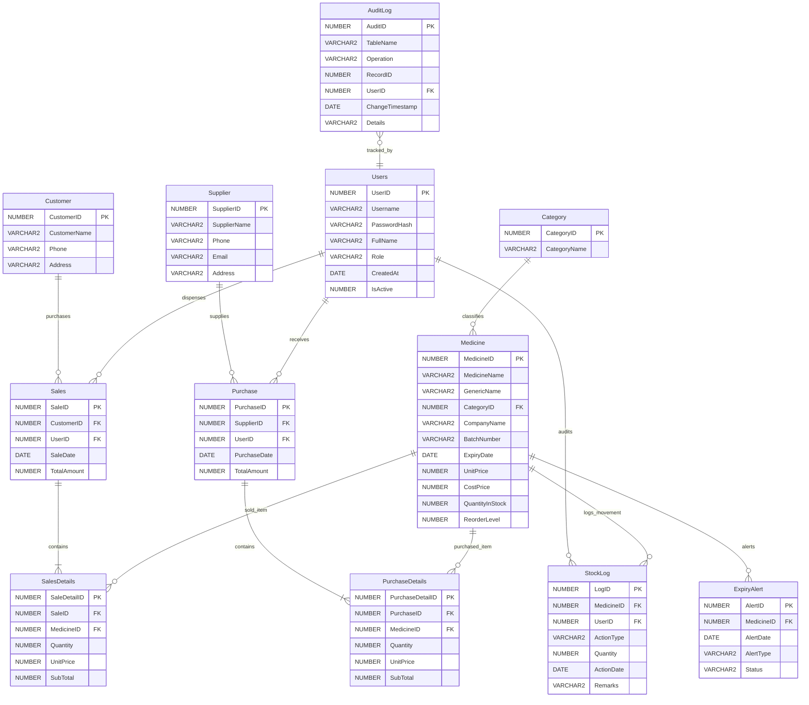

# Chapter 3: Database Deep Dive & PL/SQL Reference Manual

The **Oracle Database** is the single source of truth for **Al-Dawah Pharma**.

In enterprise pharmaceutical software, web frameworks and UI libraries may be upgraded or replaced, but corporate data must endure with 100% integrity, strict referential validation, and atomic audit logging.

This chapter provides an exhaustive, line-by-line reference of all 10 SQL scripts in the `sql/` directory, including the 12 core relational tables, 7 analytical views, 4 stored procedures, 2 deterministic functions, 6 automated triggers, and least-privilege role configuration.

---

## 1. Relational Schema Architecture (The 12 Core Tables)

The database schema is normalized to Third Normal Form (3NF) to guarantee zero data duplication, prevent delete/update anomalies, and enforce ACID transaction properties.



---

## 2. Table-by-Table Architectural Specification

### Table 1: `Users`
Stores operator identity, security credentials, and role privileges:
- `UserID`: `NUMBER` (Primary Key).
- `Username`: `VARCHAR2(50) NOT NULL UNIQUE` (Login identifier).
- `PasswordHash`: `VARCHAR2(255) NOT NULL` (BCrypt salt + hash string, work factor 11).
- `FullName`: `VARCHAR2(100) NOT NULL` (Display name on invoices and audit logs).
- `Role`: `VARCHAR2(20) NOT NULL CHECK (Role IN ('Admin', 'Pharmacist'))`.
- `CreatedAt`: `DATE DEFAULT SYSDATE NOT NULL`.
- `IsActive`: `NUMBER(1) DEFAULT 1 CHECK (IsActive IN (0, 1))`.

### Table 2: `Category`
Therapeutic groupings for pharmaceuticals:
- `CategoryID`: `NUMBER` (Primary Key).
- `CategoryName`: `VARCHAR2(100) NOT NULL UNIQUE` (e.g., Antibiotics, Analgesics, Antipyretics).

### Table 3: `Supplier`
Pharmaceutical distributors providing inventory:
- `SupplierID`: `NUMBER` (Primary Key).
- `SupplierName`: `VARCHAR2(100) NOT NULL`.
- `Phone`: `VARCHAR2(20) NOT NULL`.
- `Email`: `VARCHAR2(100)`.
- `Address`: `VARCHAR2(255)`.

### Table 4: `Customer`
Patients and clients purchasing items from the pharmacy:
- `CustomerID`: `NUMBER` (Primary Key).
- `CustomerName`: `VARCHAR2(100) NOT NULL`.
- `Phone`: `VARCHAR2(20)`.
- `Address`: `VARCHAR2(255)`.

### Table 5: `Medicine`
The core pharmaceutical inventory table:
- `MedicineID`: `NUMBER` (Primary Key).
- `MedicineName`: `VARCHAR2(100) NOT NULL` (Brand name, e.g., "Napa 500mg").
- `GenericName`: `VARCHAR2(100) NOT NULL` (Active formulation, e.g., "Paracetamol").
- `CategoryID`: `NUMBER NOT NULL REFERENCES Category(CategoryID)`.
- `CompanyName`: `VARCHAR2(100) NOT NULL` (Manufacturer, e.g., "Beximco Pharmaceuticals").
- `BatchNumber`: `VARCHAR2(50) NOT NULL` (Manufacturing production batch).
- `ExpiryDate`: `DATE NOT NULL` (Expiration threshold).
- `UnitPrice`: `NUMBER(10,2) NOT NULL CHECK (UnitPrice >= 0)` (Retail price).
- `CostPrice`: `NUMBER(10,2) NOT NULL CHECK (CostPrice >= 0)` (Wholesale cost).
- `QuantityInStock`: `NUMBER(10) DEFAULT 0 NOT NULL CHECK (QuantityInStock >= 0)`.
- `ReorderLevel`: `NUMBER(10) DEFAULT 10 NOT NULL CHECK (ReorderLevel >= 0)` (Safety warning threshold).

### Table 6: `Purchase` (Master)
Wholesale procurement shipments received from pharmaceutical suppliers:
- `PurchaseID`: `NUMBER` (Primary Key).
- `SupplierID`: `NUMBER NOT NULL REFERENCES Supplier(SupplierID)`.
- `UserID`: `NUMBER NOT NULL REFERENCES Users(UserID)`.
- `PurchaseDate`: `DATE DEFAULT SYSDATE NOT NULL`.
- `TotalAmount`: `NUMBER(12,2) DEFAULT 0 NOT NULL CHECK (TotalAmount >= 0)`.

### Table 7: `PurchaseDetails` (Child Line Items)
Individual medicine quantities included in a supplier shipment:
- `PurchaseDetailID`: `NUMBER` (Primary Key).
- `PurchaseID`: `NUMBER NOT NULL REFERENCES Purchase(PurchaseID) ON DELETE CASCADE`.
- `MedicineID`: `NUMBER NOT NULL REFERENCES Medicine(MedicineID)`.
- `Quantity`: `NUMBER(10) NOT NULL CHECK (Quantity > 0)`.
- `UnitPrice`: `NUMBER(10,2) NOT NULL CHECK (UnitPrice >= 0)`.
- `SubTotal`: `NUMBER(12,2) DEFAULT 0 NOT NULL CHECK (SubTotal >= 0)`.

### Table 8: `Sales` (Master)
Sales counter invoice headers:
- `SaleID`: `NUMBER` (Primary Key).
- `CustomerID`: `NUMBER NOT NULL REFERENCES Customer(CustomerID)`.
- `UserID`: `NUMBER NOT NULL REFERENCES Users(UserID)`.
- `SaleDate`: `DATE DEFAULT SYSDATE NOT NULL`.
- `TotalAmount`: `NUMBER(12,2) DEFAULT 0 NOT NULL CHECK (TotalAmount >= 0)`.

### Table 9: `SalesDetails` (Child Line Items)
Dispensed line items for customer sales:
- `SaleDetailID`: `NUMBER` (Primary Key).
- `SaleID`: `NUMBER NOT NULL REFERENCES Sales(SaleID) ON DELETE CASCADE`.
- `MedicineID`: `NUMBER NOT NULL REFERENCES Medicine(MedicineID)`.
- `Quantity`: `NUMBER(10) NOT NULL CHECK (Quantity > 0)`.
- `UnitPrice`: `NUMBER(10,2) NOT NULL CHECK (UnitPrice >= 0)`.
- `SubTotal`: `NUMBER(12,2) DEFAULT 0 NOT NULL CHECK (SubTotal >= 0)`.

### Table 10: `StockLog`
Immutable audit ledger recording every inventory modification:
- `LogID`: `NUMBER` (Primary Key).
- `MedicineID`: `NUMBER NOT NULL REFERENCES Medicine(MedicineID)`.
- `UserID`: `NUMBER NOT NULL REFERENCES Users(UserID)`.
- `ActionType`: `VARCHAR2(20) NOT NULL CHECK (ActionType IN ('Purchase', 'Sale', 'Adjustment', 'Return', 'Expired'))`.
- `Quantity`: `NUMBER(10) NOT NULL` (Signed: positive for stock additions, negative for sales/damage).
- `ActionDate`: `DATE DEFAULT SYSDATE NOT NULL`.
- `Remarks`: `VARCHAR2(255)`.

### Table 11: `ExpiryAlert`
Automated alert register tracking near-expiry or expired inventory batches:
- `AlertID`: `NUMBER` (Primary Key).
- `MedicineID`: `NUMBER NOT NULL REFERENCES Medicine(MedicineID)`.
- `AlertDate`: `DATE DEFAULT SYSDATE NOT NULL`.
- `AlertType`: `VARCHAR2(20) NOT NULL CHECK (AlertType IN ('Expired', 'Near Expiry'))`.
- `Status`: `VARCHAR2(20) DEFAULT 'Active' NOT NULL CHECK (Status IN ('Active', 'Dismissed', 'Resolved'))`.

### Table 12: `AuditLog`
General administrative security tracking log:
- `AuditID`: `NUMBER` (Primary Key).
- `TableName`: `VARCHAR2(50) NOT NULL`.
- `Operation`: `VARCHAR2(20) NOT NULL CHECK (Operation IN ('INSERT', 'UPDATE', 'DELETE'))`.
- `RecordID`: `NUMBER NOT NULL`.
- `UserID`: `NUMBER REFERENCES Users(UserID)`.
- `ChangeTimestamp`: `DATE DEFAULT SYSDATE NOT NULL`.
- `Details`: `VARCHAR2(1000)`.

---

## 3. The 7 Operational & Analytical Views

Views provide pre-compiled SQL queries, encapsulating joins and calculations directly inside the database.

### 1. `VW_CURRENT_STOCK`
Provides real-time inventory visibility with automated status categorization:
```sql
CREATE OR REPLACE VIEW VW_CURRENT_STOCK AS
SELECT 
    m.MedicineID,
    m.MedicineName,
    m.GenericName,
    c.CategoryName,
    m.CompanyName,
    m.BatchNumber,
    m.ExpiryDate,
    m.UnitPrice,
    m.CostPrice,
    m.QuantityInStock,
    m.ReorderLevel,
    CASE 
        WHEN m.QuantityInStock = 0 THEN 'Out of Stock'
        WHEN m.QuantityInStock <= m.ReorderLevel THEN 'Low Stock'
        ELSE 'In Stock'
    END AS StockStatus
FROM Medicine m
JOIN Category c ON m.CategoryID = c.CategoryID;
```

### 2. `VW_EXPIRED_MEDICINES`
Identifies all batches where the expiration date has passed:
```sql
CREATE OR REPLACE VIEW VW_EXPIRED_MEDICINES AS
SELECT 
    m.MedicineID,
    m.MedicineName,
    m.GenericName,
    c.CategoryName,
    m.CompanyName,
    m.BatchNumber,
    m.ExpiryDate,
    m.QuantityInStock,
    TRUNC(SYSDATE - m.ExpiryDate) AS DaysExpired
FROM Medicine m
JOIN Category c ON m.CategoryID = c.CategoryID
WHERE m.ExpiryDate < TRUNC(SYSDATE)
  AND m.QuantityInStock > 0;
```

### 3. `VW_NEAR_EXPIRY_MEDICINES`
Flags batches expiring within the next 90 days:
```sql
CREATE OR REPLACE VIEW VW_NEAR_EXPIRY_MEDICINES AS
SELECT 
    m.MedicineID,
    m.MedicineName,
    m.GenericName,
    c.CategoryName,
    m.CompanyName,
    m.BatchNumber,
    m.ExpiryDate,
    m.QuantityInStock,
    TRUNC(m.ExpiryDate - SYSDATE) AS DaysRemaining
FROM Medicine m
JOIN Category c ON m.CategoryID = c.CategoryID
WHERE m.ExpiryDate >= TRUNC(SYSDATE)
  AND m.ExpiryDate <= TRUNC(SYSDATE + 90)
  AND m.QuantityInStock > 0;
```

### 4. `VW_LOW_STOCK_MEDICINES`
Highlights drugs requiring urgent purchase replenishment:
```sql
CREATE OR REPLACE VIEW VW_LOW_STOCK_MEDICINES AS
SELECT 
    m.MedicineID,
    m.MedicineName,
    m.GenericName,
    c.CategoryName,
    m.CompanyName,
    m.QuantityInStock,
    m.ReorderLevel,
    (m.ReorderLevel - m.QuantityInStock) AS DeficitQuantity
FROM Medicine m
JOIN Category c ON m.CategoryID = c.CategoryID
WHERE m.QuantityInStock <= m.ReorderLevel;
```

### 5. `VW_MONTHLY_SALES_SUMMARY`
Aggregates sales revenue and order counts by calendar month:
```sql
CREATE OR REPLACE VIEW VW_MONTHLY_SALES_SUMMARY AS
SELECT 
    TO_CHAR(SaleDate, 'YYYY-MM') AS SalesMonth,
    COUNT(SaleID) AS TotalOrders,
    SUM(TotalAmount) AS TotalRevenue
FROM Sales
GROUP BY TO_CHAR(SaleDate, 'YYYY-MM')
ORDER BY SalesMonth DESC;
```

### 6. `VW_HIGHEST_SELLING_MEDICINES`
Ranks medicines by customer sales volume:
```sql
CREATE OR REPLACE VIEW VW_HIGHEST_SELLING_MEDICINES AS
SELECT 
    m.MedicineID,
    m.MedicineName,
    m.GenericName,
    c.CategoryName,
    SUM(sd.Quantity) AS TotalUnitsSold,
    SUM(sd.SubTotal) AS TotalRevenue
FROM SalesDetails sd
JOIN Medicine m ON sd.MedicineID = m.MedicineID
JOIN Category c ON m.CategoryID = c.CategoryID
GROUP BY m.MedicineID, m.MedicineName, m.GenericName, c.CategoryName
ORDER BY TotalUnitsSold DESC;
```

### 7. `VW_COMPANY_WISE_STOCK`
Provides inventory valuation grouped by manufacturer:
```sql
CREATE OR REPLACE VIEW VW_COMPANY_WISE_STOCK AS
SELECT 
    m.CompanyName,
    COUNT(m.MedicineID) AS TotalMedicines,
    SUM(m.QuantityInStock) AS TotalStockUnits,
    SUM(m.QuantityInStock * m.CostPrice) AS TotalCostValue,
    SUM(m.QuantityInStock * m.UnitPrice) AS TotalRetailValue
FROM Medicine m
GROUP BY m.CompanyName
ORDER BY TotalCostValue DESC;
```

---

## 4. The 6 Automated Triggers

Triggers enforce data accuracy, calculate invoice totals, update stock levels, and write audit logs automatically.

### Trigger 1: `TRG_PURCHASE_DETAIL_SUBTOTAL`
Calculates line subtotal before insertion:
```sql
CREATE OR REPLACE TRIGGER TRG_PURCHASE_DETAIL_SUBTOTAL
BEFORE INSERT OR UPDATE OF Quantity, UnitPrice
ON PurchaseDetails
FOR EACH ROW
BEGIN
    :NEW.SubTotal := :NEW.Quantity * :NEW.UnitPrice;
END;
/
```

### Trigger 2: `TRG_PURCHASE_STOCK`
Increments inventory and writes an audit record in `StockLog`:
```sql
CREATE OR REPLACE TRIGGER TRG_PURCHASE_STOCK
AFTER INSERT
ON PurchaseDetails
FOR EACH ROW
DECLARE
    v_userid Purchase.UserID%TYPE;
    v_logid  NUMBER;
BEGIN
    SELECT UserID INTO v_userid
    FROM Purchase
    WHERE PurchaseID = :NEW.PurchaseID;

    UPDATE Medicine
    SET QuantityInStock = NVL(QuantityInStock, 0) + :NEW.Quantity
    WHERE MedicineID = :NEW.MedicineID;

    SELECT NVL(MAX(LogID), 0) + 1 INTO v_logid FROM StockLog;

    INSERT INTO StockLog (LogID, MedicineID, UserID, ActionType, Quantity, ActionDate, Remarks)
    VALUES (v_logid, :NEW.MedicineID, v_userid, 'Purchase', :NEW.Quantity, SYSDATE,
            'Purchase Invoice #' || :NEW.PurchaseID || ' - Received ' || :NEW.Quantity || ' units');
END;
/
```

### Trigger 3: `TRG_SALES_DETAIL_SUBTOTAL`
Calculates sales line subtotal before insertion:
```sql
CREATE OR REPLACE TRIGGER TRG_SALES_DETAIL_SUBTOTAL
BEFORE INSERT OR UPDATE OF Quantity, UnitPrice
ON SalesDetails
FOR EACH ROW
BEGIN
    :NEW.SubTotal := :NEW.Quantity * :NEW.UnitPrice;
END;
/
```

### Trigger 4: `TRG_SALES_STOCK`
Deducts inventory, validates sufficient stock, and creates an audit record:
```sql
CREATE OR REPLACE TRIGGER TRG_SALES_STOCK
AFTER INSERT
ON SalesDetails
FOR EACH ROW
DECLARE
    v_userid   Sales.UserID%TYPE;
    v_logid    NUMBER;
    v_curstock NUMBER;
BEGIN
    SELECT QuantityInStock INTO v_curstock
    FROM Medicine
    WHERE MedicineID = :NEW.MedicineID;

    IF v_curstock < :NEW.Quantity THEN
        RAISE_APPLICATION_ERROR(-20001,
            'Insufficient stock for Medicine ID ' || :NEW.MedicineID ||
            '. Available: ' || v_curstock || ', Requested: ' || :NEW.Quantity);
    END IF;

    UPDATE Medicine
    SET QuantityInStock = QuantityInStock - :NEW.Quantity
    WHERE MedicineID = :NEW.MedicineID;

    SELECT UserID INTO v_userid
    FROM Sales
    WHERE SaleID = :NEW.SaleID;

    SELECT NVL(MAX(LogID), 0) + 1 INTO v_logid FROM StockLog;

    INSERT INTO StockLog (LogID, MedicineID, UserID, ActionType, Quantity, ActionDate, Remarks)
    VALUES (v_logid, :NEW.MedicineID, v_userid, 'Sale', -:NEW.Quantity, SYSDATE,
            'Sale Invoice #' || :NEW.SaleID || ' - Dispensed ' || :NEW.Quantity || ' units');
END;
/
```

### Trigger 5: `TRG_PURCHASE_TOTAL`
Recalculates master purchase invoice total:
```sql
CREATE OR REPLACE TRIGGER TRG_PURCHASE_TOTAL
AFTER INSERT OR UPDATE OR DELETE
ON PurchaseDetails
FOR EACH ROW
DECLARE
    v_pid NUMBER;
BEGIN
    IF DELETING THEN
        v_pid := :OLD.PurchaseID;
    ELSE
        v_pid := :NEW.PurchaseID;
    END IF;

    UPDATE Purchase
    SET TotalAmount = (
        SELECT NVL(SUM(SubTotal), 0)
        FROM PurchaseDetails
        WHERE PurchaseID = v_pid
    )
    WHERE PurchaseID = v_pid;
END;
/
```

### Trigger 6: `TRG_SALES_TOTAL`
Recalculates master sales invoice total:
```sql
CREATE OR REPLACE TRIGGER TRG_SALES_TOTAL
AFTER INSERT OR UPDATE OR DELETE
ON SalesDetails
FOR EACH ROW
DECLARE
    v_sid NUMBER;
BEGIN
    IF DELETING THEN
        v_sid := :OLD.SaleID;
    ELSE
        v_sid := :NEW.SaleID;
    END IF;

    UPDATE Sales
    SET TotalAmount = (
        SELECT NVL(SUM(SubTotal), 0)
        FROM SalesDetails
        WHERE SaleID = v_sid
    )
    WHERE SaleID = v_sid;
END;
/
```

---

## 5. The 4 Stored Procedures

### Procedure 1: `ADD_CATEGORY`
Enforces duplicate checks on ID and category name:
```sql
CREATE OR REPLACE PROCEDURE ADD_CATEGORY(
    p_categoryid   IN NUMBER,
    p_categoryname IN VARCHAR2
) AS
    v_count NUMBER;
BEGIN
    SELECT COUNT(*) INTO v_count FROM Category WHERE CategoryID = p_categoryid;
    IF v_count > 0 THEN
        RAISE_APPLICATION_ERROR(-20010, 'Category ID ' || p_categoryid || ' already exists.');
    END IF;

    SELECT COUNT(*) INTO v_count FROM Category WHERE UPPER(CategoryName) = UPPER(TRIM(p_categoryname));
    IF v_count > 0 THEN
        RAISE_APPLICATION_ERROR(-20011, 'Category name ''' || p_categoryname || ''' already exists.');
    END IF;

    INSERT INTO Category (CategoryID, CategoryName) VALUES (p_categoryid, TRIM(p_categoryname));
    COMMIT;
EXCEPTION
    WHEN OTHERS THEN
        ROLLBACK;
        RAISE;
END;
/
```

### Procedure 2: `ADD_MEDICINE`
Validates foreign key references and non-negative pricing before insertion:
```sql
CREATE OR REPLACE PROCEDURE ADD_MEDICINE(
    p_medicineid        IN NUMBER,
    p_medicinename      IN VARCHAR2,
    p_genericname       IN VARCHAR2,
    p_categoryid        IN NUMBER,
    p_companyname       IN VARCHAR2,
    p_batchnumber       IN VARCHAR2,
    p_expirydate        IN DATE,
    p_unitprice         IN NUMBER,
    p_costprice         IN NUMBER,
    p_quantityinstock   IN NUMBER,
    p_reorderlevel      IN NUMBER
) AS
    v_count NUMBER;
BEGIN
    SELECT COUNT(*) INTO v_count FROM Category WHERE CategoryID = p_categoryid;
    IF v_count = 0 THEN
        RAISE_APPLICATION_ERROR(-20022, 'Category ID ' || p_categoryid || ' does not exist.');
    END IF;

    IF p_unitprice < 0 OR p_costprice < 0 THEN
        RAISE_APPLICATION_ERROR(-20023, 'Price values cannot be negative.');
    END IF;

    INSERT INTO Medicine (
        MedicineID, MedicineName, GenericName, CategoryID, CompanyName,
        BatchNumber, ExpiryDate, UnitPrice, CostPrice, QuantityInStock, ReorderLevel
    ) VALUES (
        p_medicineid, TRIM(p_medicinename), TRIM(p_genericname), p_categoryid, TRIM(p_companyname),
        TRIM(p_batchnumber), p_expirydate, p_unitprice, p_costprice, NVL(p_quantityinstock, 0), NVL(p_reorderlevel, 10)
    );
    COMMIT;
EXCEPTION
    WHEN OTHERS THEN
        ROLLBACK;
        RAISE;
END;
/
```

### Procedure 3: `RECORD_PURCHASE`
Creates the master purchase order record:
```sql
CREATE OR REPLACE PROCEDURE RECORD_PURCHASE(
    p_purchaseid   IN NUMBER,
    p_supplierid   IN NUMBER,
    p_userid       IN NUMBER,
    p_purchasedate IN DATE DEFAULT SYSDATE
) AS
BEGIN
    INSERT INTO Purchase (PurchaseID, SupplierID, UserID, PurchaseDate, TotalAmount)
    VALUES (p_purchaseid, p_supplierid, p_userid, NVL(p_purchasedate, SYSDATE), 0);
    COMMIT;
EXCEPTION
    WHEN OTHERS THEN
        ROLLBACK;
        RAISE;
END;
/
```

### Procedure 4: `RECORD_SALE`
Creates the master sales transaction record:
```sql
CREATE OR REPLACE PROCEDURE RECORD_SALE(
    p_saleid     IN NUMBER,
    p_customerid IN NUMBER,
    p_userid     IN NUMBER,
    p_saledate   IN DATE DEFAULT SYSDATE
) AS
BEGIN
    INSERT INTO Sales (SaleID, CustomerID, UserID, SaleDate, TotalAmount)
    VALUES (p_saleid, p_customerid, p_userid, NVL(p_saledate, SYSDATE), 0);
    COMMIT;
EXCEPTION
    WHEN OTHERS THEN
        ROLLBACK;
        RAISE;
END;
/
```

---

## 6. The 2 Deterministic Stored Functions

### Function 1: `GET_AVAILABLE_STOCK`
```sql
CREATE OR REPLACE FUNCTION GET_AVAILABLE_STOCK(p_medicine_id IN NUMBER)
RETURN NUMBER IS
    v_stock NUMBER := 0;
BEGIN
    SELECT NVL(QuantityInStock, 0)
    INTO v_stock
    FROM Medicine
    WHERE MedicineID = p_medicine_id;

    RETURN v_stock;
EXCEPTION
    WHEN NO_DATA_FOUND THEN
        RETURN 0;
END;
/
```

### Function 2: `GET_INVENTORY_VALUE`
Computes total wholesale asset valuation:
```sql
CREATE OR REPLACE FUNCTION GET_INVENTORY_VALUE
RETURN NUMBER IS
    v_total NUMBER := 0;
BEGIN
    SELECT NVL(SUM(QuantityInStock * CostPrice), 0)
    INTO v_total
    FROM Medicine;

    RETURN v_total;
END;
/
```

---

## 7. Role Privileges & Public Synonyms

The script `07_roles_privileges.sql` implements least-privilege security:
- **Application User**: `C##PHARMACY_APP` (Password: `PharmacyApp2026#`).
- **Role**: `RL_PHARMACY_APP`.
- Grants `SELECT`, `INSERT`, `UPDATE`, `DELETE` on all 12 tables.
- Grants `EXECUTE` on the 4 procedures and 2 functions.
- Grants `SELECT` on all 7 views.
- Creates public synonyms so that application queries write `SELECT * FROM Medicine` rather than `SELECT * FROM SYSTEM.Medicine`.
